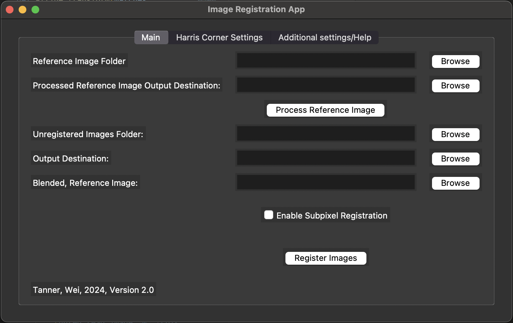

# image registration
# Jianya Wei, Noah Tanner
# Fall 2024

 

### Table of Contents
1. [Purpose](#purpose)
2. [Installation](#installation)
3. [Usage](#usage)
4. [Contribution](#contribution)
5. [License](#license)

# Purpose
In studying a Pressure & Temperature Sensitive Paint for the University of Washington's Quantitative Flow Visualization Laboratory, it was necessary to create an image registration tool to line up the pixels of test images that were to be processed into pressure distributions. To do so, a Research paper outlining an image warping method of image resgistration method written by Heider K. Ali was implemented. 

The key features of this application are as follows:
1. Input and ouput destination selection
2. Optional tunable parameteres for Harris Corner Detection
3. Error detailing and output in Terminal
4. Less than 1% difference in per pixel value between a registered and unregistered image
5. Error .txt output files to quickly asses results

# Installation
On Mac, this application can be ran by cloning the repository and then running the following commands while in the root directory:

    Install dependencies: 
    $ pip install -r requirements.txt

    Run the GUI
    $ python3 image_registration_gui.py

# Usage
Currently only tested on Mac.

# Contribution
There are a lot of features that could be implemented. Message me if you would like to help: noahetanner@gmail.com

# License
MIT License

Copyright (c) [2024] [noah tanner]

Permission is hereby granted, free of charge, to any person obtaining a copy
of this software and associated documentation files (the "Software"), to deal
in the Software without restriction, including without limitation the rights
to use, copy, modify, merge, publish, distribute, sublicense, and/or sell
copies of the Software, and to permit persons to whom the Software is
furnished to do so, subject to the following conditions:

The above copyright notice and this permission notice shall be included in all
copies or substantial portions of the Software.

THE SOFTWARE IS PROVIDED "AS IS", WITHOUT WARRANTY OF ANY KIND, EXPRESS OR
IMPLIED, INCLUDING BUT NOT LIMITED TO THE WARRANTIES OF MERCHANTABILITY,
FITNESS FOR A PARTICULAR PURPOSE AND NONINFRINGEMENT. IN NO EVENT SHALL THE
AUTHORS OR COPYRIGHT HOLDERS BE LIABLE FOR ANY CLAIM, DAMAGES OR OTHER
LIABILITY, WHETHER IN AN ACTION OF CONTRACT, TORT OR OTHERWISE, ARISING FROM,
OUT OF OR IN CONNECTION WITH THE SOFTWARE OR THE USE OR OTHER DEALINGS IN THE
SOFTWARE.
